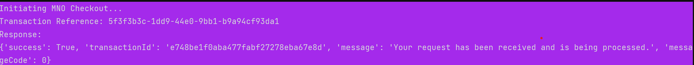

# AzamPay Python SDK

**Official Python SDK for integrating AzamPay payment services**  
Supports **Pure Python**, **Django**, **Flask**, **FastAPI**, and more.

> **Note:** Versions **< 0.1.8** supported **Mobile Network Operator (MNO) payments only**.  
> **Version 0.1.8+** introduces full **Bank Payments** support.

<p align="start">
  
</p>

[](https://pypi.org/project/azampay-sdk-anga/)
[](https://pepy.tech/projects/azampay-sdk-anga)
[](https://pepy.tech/projects/azampay-sdk-anga)
[](https://pepy.tech/projects/azampay-sdk-anga)
[](https://app.codacy.com/gh/tbwahacker/azampay-sdk-anga/dashboard)

## Supported Payment Providers

| Mobile Money (MNO) | Banks |
|--------------------|-------|
| M-Pesa             | CRDB  |
| Airtel Money       | NMB   |
| Halopesa           |       |
| Tigo Pesa          |       |
| Azampesa           |       |
| Mix by Yas         |       |

---

## Installation

```bash
pip install azampay-sdk-anga
```

## Environment Configuration

Go to your account at https://developers.azampay.co.tz/ copy client-id, client-secret and app-name details

Create a `.env` file in your project root and paste the details/configs:

```env
AZAMPAY_ENVIRONMENT=sandbox        # Use 'production' for live
AZAMPAY_APP_NAME=your-app-name
AZAMPAY_CLIENT_ID=your-client-id
AZAMPAY_CLIENT_SECRET=your-secret
```

---

## Quick Start

```python
import uuid
from azampay import AzamPay

try:
    # Generate a unique external ID
    external_id = str(uuid.uuid4())

    # Sample transaction details
    mobile = "0712345678"
    amount = 5000
    currency = "TZS"
    provider = "TIGO"  # Options: Mpesa, Airtel, Halotel, Azampesa, Tigo

    print("Initiating MNO Checkout...")
    response, ref = AzamPay.mno_checkout(
        mobile_number=mobile,
        amount=amount,
        currency=currency,
        provider=provider,
        external_id=external_id
    )

    print(f"Transaction Reference: {ref}")
    print("Response:", response)

except Exception as e:
    print("Transaction failed:", str(e))
```

---

## Webhook (Callback) Setup

> **Important:** Register your callback URL in the **AzamPay Developer Portal**.

Create a webhook endpoint to receive payment status updates.

### Example: `callback_url.py` (Django)

```python
import json
from django.http import HttpResponse
from django.views.decorators.csrf import csrf_exempt

from main import Main       # Your class
from db import conn         # Your DB connection (e.g., pymysql)


@csrf_exempt
def callback_view(request):
    if request.method != "POST":
        return HttpResponse("Invalid method", status=405)

    try:
        data = json.loads(request.body.decode("utf-8"))
    except Exception:
        return HttpResponse("Server error", status=500)

    if not data or "utilityref" not in data or "transactionstatus" not in data:
        return HttpResponse("Invalid payload", status=400)

    utility_ref = data["utilityref"]
    status = "success" if data["transactionstatus"].lower() == "success" else "rejected"

    ######## Your logic to update status in your db, depends on your database codes and setups  ###########
    main = Main(conn)

    count, result = main.all_query_nolimit_s(
        "transactions",
        'AND status="pending" LIMIT 1',
        "reference",
        utility_ref
    )

    if count > 0:
        main.update_custom_o(
            "transactions",
            "status",
            status,
            "reference",
            utility_ref,
            'AND status="pending"'
        )
     ################ End of Db save status ######################
        return HttpResponse("Transaction updated", status=200)

    return HttpResponse("Transaction not found", status=404)


# Example: urls.py will look like
from django.urls import path
from .views import callback_view

urlpatterns = [
    path("callback/", callback_view, name="callback"),
]
```

### Example: `callback_url.py` (Flask)

```python
from flask import Flask, request
from main import Main
from db import conn  # Your DB connection (e.g., pymysql)

app = Flask(__name__)

@app.route('/callback', methods=['POST'])
def callback():
    if request.method != 'POST':
        return "Invalid method", 405

    try:
        data = request.get_json()
    except Exception:
        return "Server error", 500

    if not data or 'utilityref' not in data or 'transactionstatus' not in data:
        return "Invalid payload", 400

    utility_ref = data['utilityref']
    status = 'success' if data['transactionstatus'].lower() == 'success' else 'rejected'

    ######## Your logic to update status in your db, depends on your database codes and setups  ###########
    main = Main(conn)
    count, result = main.all_query_nolimit_s(
        'transactions',
        'AND status="pending" LIMIT 1',
        'reference',
        utility_ref
    )

    if count > 0:
        main.update_custom_o(
            'transactions', 'status', status, 'reference', utility_ref, 'AND status="pending"'
        )
        return "Transaction updated", 200
    else:
        return "Transaction not found", 404
   ################ End of Db save status ######################
```

---

## Success Response Example



---

## Transaction Status Check & Redirect Page (Optional and you can design according to your code flow or tech)

Create a route to check payment status and redirect users. (Optional and you can design according to your code flow or tech)

### `templates/redirect.html`

```html
<!DOCTYPE html>
<html lang="en">
<head>
    <meta charset="UTF-8">
    <title>Transaction Status</title>
    <link href="{{ url_for('static', filename='bootstrap/css/bootstrap.min.css') }}" rel="stylesheet">
</head>
<body class="bg-light d-flex justify-content-center align-items-center" style="height: 100vh;">
    <div class="container text-center">
        
            <div class="alert alert-success shadow p-4 rounded" role="alert">
                <h1 class="mb-3">Transaction Approved</h1>
                <p class="lead">Your payment was successful.</p>
                <a href="/" class="btn btn-success mt-3">Go Home</a>
            </div>
        
            <div class="alert alert-danger shadow p-4 rounded" role="alert">
                <h1 class="mb-3">Transaction Failed</h1>
                <p class="lead">Payment failed. Please try again.</p>
                <a href="/" class="btn btn-danger mt-3">Try Again</a>
            </div>
        
    </div>
    <script src="{{ url_for('static', filename='bootstrap/js/bootstrap.bundle.min.js') }}"></script>
</body>
</html>
```

---

## Credits & Inspiration

- **Anganile Adam (Anga)** – [GitHub: tbwahacker](https://github.com/tbwahacker)
- **AzamPay Team** – [Official Docs](https://developerdocs.azampay.co.tz/redoc)
- **Tanzania Developer Community** – You can now build with AzamPay in Python!
- [All Contributors](../../contributors)

---

## Issues & Support

Found a bug? Open an issue:  
[GitHub Issues](https://github.com/tbwahacker/azampay-sdk-anga/issues)

---

## Support the Project

If you find this SDK useful, please:

- Star this repository
- Share it with fellow developers

**Buy me a coffee**  
**M-Pesa:** `0685750593` | `0768571150`  
**Email:** `twaloadam@gmail.com` | `anganileadam87@gmail.com`

---

## License

[MIT License](LICENSE) – Free to use, modify, and distribute.

---

## Contribute

> **"Feel free to contribute!"**

1. Fork the repository
2. Create a feature branch
3. Document your changes
4. Submit a Pull Request with a review request

---

**Happy coding! Make payments easy with AzamPay & Python.**
```
```
